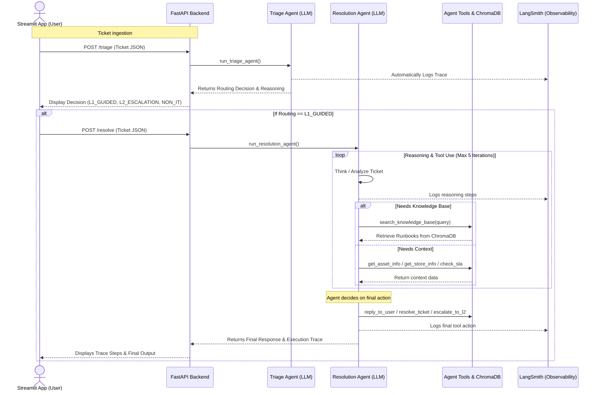

# ServeWell Agentic IT Support Flow

The ServeWell IT support system is an agentic workflow that triages and resolves L1 support tickets using Large Language Models and Retrieval-Augmented Generation (RAG).

## Architecture & Interaction Flow

## Core Components

> [!TIP]
> **LangSmith Observability** is embedded directly into the OpenAI clients. Any call to `openai.OpenAI` (whether for the main agent loop or generating embeddings for ChromaDB) is logged seamlessly to your LangSmith project.

### 1. Triage Agent (`run_triage_agent`)
- **Role**: Initial dispatcher. Analyzes the raw incident ticket.
- **Possible Outcomes**:
  - `L1_GUIDED`: Issue can be solved using standard runbooks (e.g., POS offline, receipt printer).
  - `L2_ESCALATION`: Issue is highly complex, requires physical intervention, or is P1 critical.
  - `NON_IT`: Issue is HR/Facilities related.

### 2. Resolution Agent (`run_resolution_agent`)
- **Role**: L1 Support Specialist. Actively troubleshoots the issue iteratively.
- **Workflow**: 
  1. Analyzes symptoms.
  2. Actively searches the Knowledge Base (ChromaDB) for relevant standard operating procedures (SOPs).
  3. Looks up Asset/Store data if necessary.
  4. Decides to either reply to the user with steps, resolve the ticket if fixed, or escalate if runbooks don't cover it.

### 3. Knowledge Base / RAG (`rag_setup.py`)
- **Role**: Ingests markdown files from the `kb/` directory, chunks them, generates embeddings using `text-embedding-3-small`, and stores them locally in ChromaDB.
- **Retrieval**: When the Resolution Agent calls `search_knowledge_base`, the query is embedded and compared against the vector store to fetch relevant documents.
