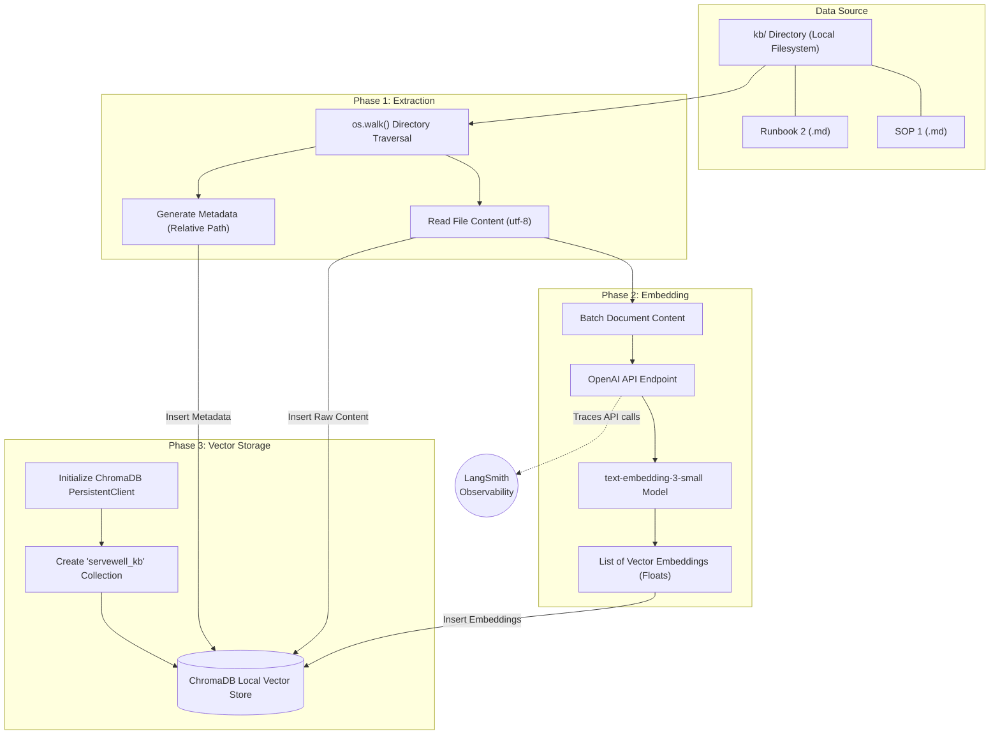

# Data Ingestion Pipeline (`rag_setup.py`)

This document details the step-by-step data ingestion pipeline that occurs when you execute the `rag_setup.py` script. This process is responsible for transforming raw markdown Knowledge Base files into searchable vector embeddings stored locally.

## Pipeline Architecture

## Detailed Execution Steps

### 1. Initialization and Cleanup
When `setup_rag()` is invoked, it first establishes a connection to the local ChromaDB storage at the `chroma_db/` directory. If a collection named `servewell_kb` already exists from a previous run, it is deliberately deleted to prevent data duplication. A fresh `servewell_kb` collection is then created.

### 2. Document Loading (`load_documents()`)
The script recursively traverses the `kb/` directory using `os.walk`. For every file ending in `.md`:
- The raw text content is read into memory.
- The **relative file path** (e.g., `pos/pos_offline.md`) is recorded. This string serves a dual purpose: it acts as the unique **Document ID** in ChromaDB, and it is saved as **Metadata** (`{"source": rel_path}`) so the LLM agent knows exactly which file it is citing later on.

### 3. Generating Embeddings (`get_openai_embeddings()`)
The raw text contents of all loaded documents are grouped into a list and sent to the embedding provider.
- By default, it uses the OpenAI API (or OpenRouter if configured in `.env`).
- It uses the high-performance `text-embedding-3-small` model to convert the textual semantics into high-dimensional float arrays (vectors).
- **Observability:** Because the OpenAI client is wrapped with LangSmith (`wrappers.wrap_openai`), this entire embedding generation process, including token usage and latency, is logged to your LangSmith project.

### 4. Database Population
Finally, the pipeline aligns the raw text documents, the generated vector embeddings, the metadata dictionaries, and the unique IDs, and inserts them collectively into the `servewell_kb` ChromaDB collection via `collection.add()`. 

The data is now persisted on disk and immediately available for semantic search via cosine similarity!
