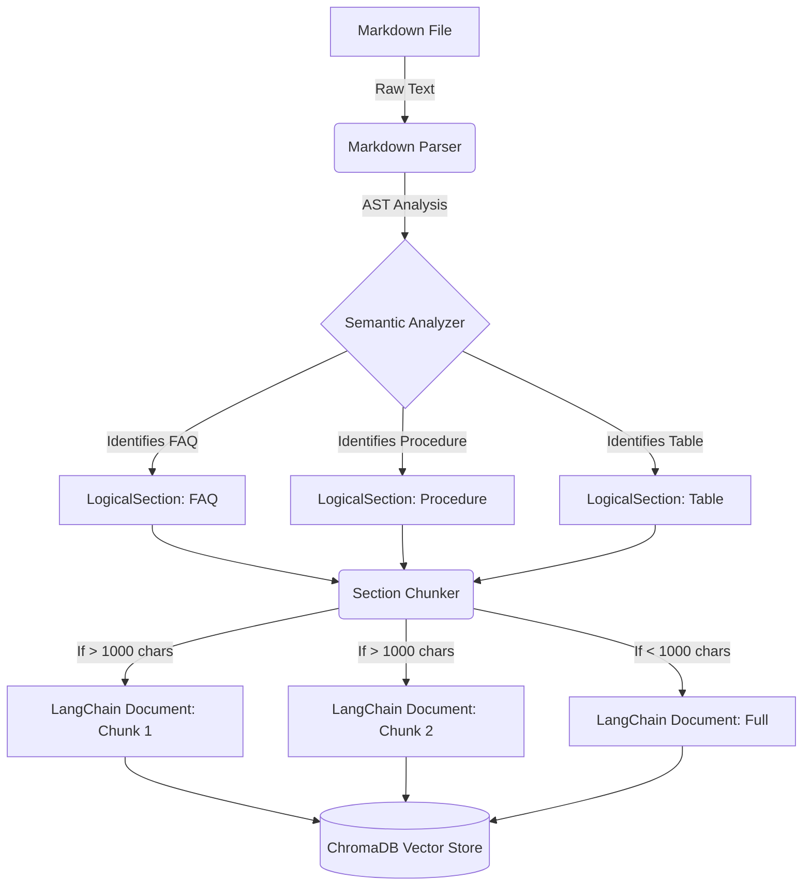

# Data Ingestion Architecture Design

This document details the architectural decisions made for the Data Ingestion pipeline, specifically focusing on the separation of concerns between Markdown parsing and logical chunking.

## 1. High-Level Architecture



## 2. Component Design

### 2.1 The Parser (`services/parser.py`)
**Responsibility**: Transform flat markdown text into highly structured, semantically meaningful `LogicalSection` blocks.

**Core Mechanism**:
- Uses `markdown-it-py` to generate an Abstract Syntax Tree (AST) of the markdown file.
- Uses `SyntaxTreeNode` to traverse the tree hierarchy, ensuring that all paragraphs, lists, and tables that belong under a specific Markdown heading (`#`, `##`, `###`) remain grouped together.
- Eliminates the blind "chunk by length" approach by deeply understanding the document's structure.

**Semantic Recognition Rules**:
1. **FAQ Detection**: If a section's text contains both `**Q:` and `A:`, it is tagged with `section_type = 'faq'`.
2. **Procedure Detection**: If the heading text contains words like "step" or "procedure", it is tagged as `section_type = 'procedure'`.
3. **Table Detection**: If the AST contains a table node, it is tagged as `section_type = 'table'`.
4. **General**: If no specific rules match, it defaults to `general`.

### 2.2 The Chunker (`services/chunker.py`)
**Responsibility**: Ensure that no single `LogicalSection` exceeds the context window or optimal embedding length of the embedding model, while preserving all metadata.

**Core Mechanism**:
- Evaluates the character length of each `LogicalSection` produced by the Parser.
- If the section is small (under 1000 characters), it is immediately transformed into a LangChain `Document` without modification.
- If the section is excessively large, it utilizes LangChain's `RecursiveCharacterTextSplitter` to safely divide the text along natural paragraph or sentence boundaries.
- **Metadata Propagation**: The chunker guarantees that the `section_title`, `section_type`, and base metadata (file path, folder) are deeply copied and attached to *every* resulting split chunk.

## 3. Data Model

The pipeline relies on a clean data transfer object between the Parser and Chunker.

```python
@dataclass
class LogicalSection:
    title: str               # The closest preceding markdown heading
    content: str             # The raw text of the section
    section_type: str        # 'faq', 'procedure', 'table', or 'general'
    metadata: Dict[str, Any] # Inherited metadata (file path, category)
```

## 4. Why This Architecture?

1. **Better Retrieval Context**: By keeping an entire FAQ question and answer together in one `LogicalSection`, the embedding model captures the full semantic meaning.
2. **Targeted Filtering**: Because chunks are tagged with `section_type` (e.g. `faq`), the Query Pipeline can perform metadata filtering (e.g. "Only search FAQs for this user query").
3. **Resilience**: The system gracefully falls back to length-based splitting only as a last resort for unusually long sections, ensuring no crash occurs during embedding.
