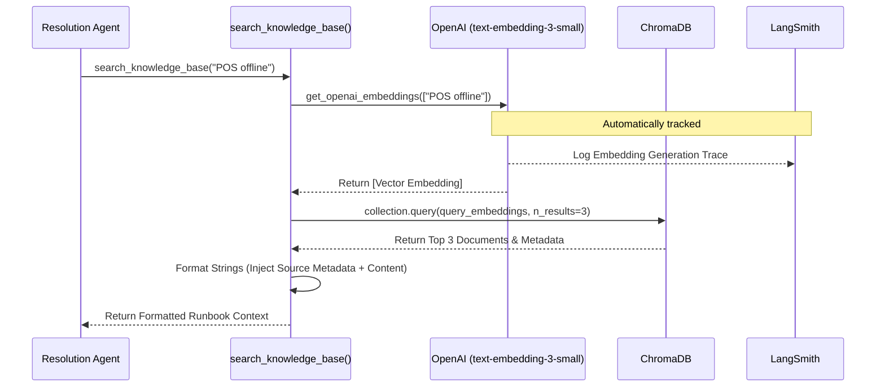

# RAG Setup & Execution Flow (`rag_setup.py`)

This document outlines the architecture and execution flow for the Retrieval-Augmented Generation (RAG) module used in the ServeWell IT Support system.

## 1. Setup Flow (Vector Database Initialization)

When `setup_rag()` is executed, the system processes the local knowledge base and populates the Chroma vector database.

```mermaid
flowchart TD
    A[Start: setup_rag()] --> B[Initialize ChromaDB PersistentClient]
    B --> C{Collection exists?}
    C -- Yes --> D[Delete Collection]
    C -- No --> E[Create 'servewell_kb' Collection]
    D --> E
    
    E --> F[load_documents()]
    F --> G[Scan 'kb/' directory for .md files]
    G --> H[Extract Document Content, Metadata, and IDs]
    
    H --> I[get_openai_embeddings()]
    I --> J[Call OpenAI API: text-embedding-3-small]
    J --> K[Receive Vector Embeddings]
    
    K --> L[Add Documents, Embeddings, and Metadata to ChromaDB]
    L --> M[End: RAG Setup Complete]
```

## 2. Retrieval Flow (Querying the Knowledge Base)

When the Resolution Agent needs to look up a runbook during troubleshooting, it utilizes the `search_knowledge_base(query)` tool.



## Core Components Overview

- **`load_documents()`**: Recursively walks the `kb/` (Knowledge Base) directory looking for markdown (`.md`) files. It extracts the raw text and uses the relative path as the document ID and Source metadata.
- **`get_openai_embeddings()`**: Interfaces with the OpenAI API (or OpenRouter depending on API keys provided in `.env`) to generate high-quality text embeddings. Wrapped with LangSmith for observability.
- **`search_knowledge_base()`**: The primary interface for the LLM Agent. It converts a raw string query into a vector, calculates cosine similarity within ChromaDB, and returns the top 3 most relevant matches as a formatted string context for the agent to read.
